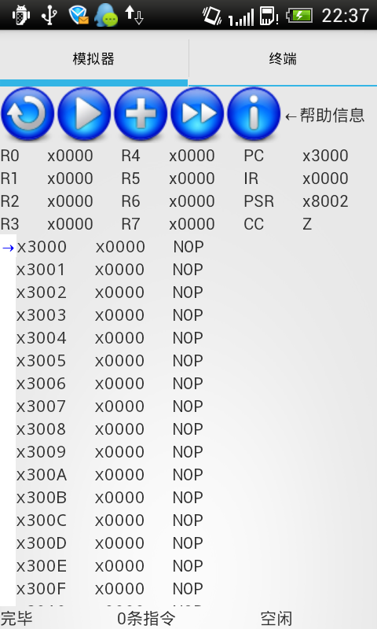

# LC3_SIM

A LC-3 simulator of Android edition.

[Here](en.wikipedia.org/wiki/LC-3) is an introduction of LC-3.

- - -

# SDK vs NDK

I want the simulator can run on all the android devices, including x86-based and MIPS-based devices. So I only use SDK which means I only write Java codes.

- - -

# I18N & L10N

Just as any other android project, add a folder named `values-LANG` with strings.xml inside in `res/` and then send PR to me. res/values-zh is an example.

- - -

# Screenshots

